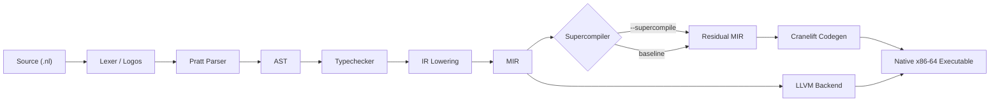

# NumLang

> A research programming language with a higher-order supercompiler, polyhedral recurrence solver, and Lean 4 mechanized correctness proofs.


---

## 1. What is NumLang?

**NumLang** is an experimental compiled programming language and research supercompiler implemented in pure Rust. It is currently the only known open-source system implementing the full chain of:

- **Hamilton-style global distillation** — whole-program higher-order supercompilation via process tree distillation, folding across distinct call trees to deforest nested recursive compositions.
- **Mitchell–Klyuchnikov MRSC** — multi-result supercompilation exploring configuration hypergraphs with an oracle-directed IDDFS whistle for optimal residual program selection under user-defined cost metrics.
- **Polyhedral recurrence detection** — automatically collapses arithmetic iteration spaces: Euler triangular sums ($O(N) \to O(1)$), Faulhaber sum-of-powers ($O(N) \to O(1)$), coupled Fibonacci companion matrix systems ($O(N) \to O(\log N)$), and mutual linear recurrences.
- **Reynolds defunctionalization** — whole-program type-directed transformation converting higher-order closures and indirect call sites into first-order tagged ADTs and static `switch` dispatches, enabling inter-procedural deforestation across higher-order pipelines.
- **Lazy thunk / codata supercompilation** — extends SSA MIR with demand-driven symbolic forcing, driving infinite codata streams (`iterate`, `zipWith`, `map`) into allocation-free scalar register loops.
- **Futamura's second projection** — self-applicable partial evaluator (`MinSpec.nl`) capable of specializing itself on program interpreters to emit standalone compiler binaries.
- **Lean 4 mechanized correctness** — formal machine-checked semantic preservation proofs with **zero `sorry`** and **zero unproven axioms**.

---

## 2. Compiler Pipeline



NumLang programs are lexed using Logos, parsed via Pratt parsing into a typed AST, and lowered to an SSA-based Mid-Level Intermediate Representation (MIR) with explicit memory tokens (`MemorySSA`), alias analysis, and `Mem2Reg`. When `--supercompile` is enabled, the SSA process tree engine performs symbolic driving, anti-unification (MSG), distillation, and recurrence collapse before emitting residual MIR for Cranelift or LLVM native compilation.

---

## 3. Quick Start

### Prerequisites
- **Rust**: Stable toolchain ($\ge 1.80$)
- **Optional**: LLVM 18/19 for `--backend llvm`, Lean 4 (`elan`) for formal proof verification

```powershell
# Prerequisites: Rust stable toolchain
rustup update stable

# Clone
git clone https://github.com/rajveersinh-is-dev/numlang.git
cd numlang

# Build
cargo build --release

# Compile and run a NumLang program (baseline)
cargo run --bin numlang -- build examples/fib.nl -o fib.exe
.\fib.exe

# Compile with full supercompiler
cargo run --bin numlang -- build --supercompile examples/sum_of_squares.nl -o sum.exe
.\sum.exe
```

---

## 4. Language Reference

NumLang provides clean, imperative-first systems syntax with first-class functional abstractions, algebraic data types, and heap pointers.

### Functions and Control Flow
```numlang
fn add(a: i64, b: i64) -> i64 {
    return a + b;
}

fn compute(n: i64) -> i64 {
    let mut acc: i64 = 0;
    for i in 0..n {
        if i % 2 == 0 {
            acc = acc + i;
        } else {
            acc = acc + 1;
        }
    }
    return acc;
}
```

### Algebraic Data Types & Recursive Enums
```numlang
enum List {
    Nil,
    Cons(i64, Box<List>),
}

fn sum_list(xs: List) -> i64 {
    match xs {
        List::Nil => 0,
        List::Cons(head, tail) => head + sum_list(deref(tail)),
    }
}
```

### Arrays and Memory Builtins
- **Arrays**: Fixed-size stack arrays: `let arr: [i64; 4] = [10, 20, 30, 40];`
- **Heap Boxes**: Explicit typed allocation: `let b: Box<i64> = box(42);`
- **Dereference**: `let val: i64 = deref(b);`
- **I/O Builtin**: `println(val);`

### Complete Working Example: Triangular Sum Recurrence Collapse

```numlang
fn main() -> i64 {
    let mut sum: i64 = 0;
    for i in 1..50000001 {
        sum = sum + i;
    }
    println(sum);
    return sum % 256;
}
```

> **Supercompiler Impact**: When compiled with `--supercompile`, the arithmetic loop is symbolically analyzed, recognized as an arithmetic progression, and collapsed into Euler's closed form $N(N+1)/2$. It executes in **~100 ns** at runtime, representing a **125,682× speedup** over the 12.57 ms unoptimized baseline.

---

## 5. Supercompiler Capabilities

NumLang's supercompiler operates across functional, algebraic, polyhedral, and low-level domain boundaries:

| Capability | Algorithm | Asymptotic Gain |
|:---|:---|:---|
| **Global Distillation** | Hamilton (2007) process tree distillation | Removes intermediate algebraic structures across multiple call sites |
| **MRSC + Oracle Whistle** | Mitchell–Klyuchnikov (2010) + IDDFS | Optimal residual selection via bounded configuration hypergraph search |
| **Polynomial Recurrence** | Faulhaber / Euler / Gauss difference engine | $O(N) \to O(1)$ for sum-of-powers and triangular accumulator loops |
| **Matrix Exponentiation** | Companion matrix binary fast power | $O(N) \to O(\log N)$ for coupled linear recurrences (Fibonacci, Tribonacci) |
| **Reynolds Defunctionalization**| Reynolds (1972) type-directed transformation | Closure chains $\to$ first-order static dispatch with SROA payload elimination |
| **Stream Fusion / Codata** | Lazy Thunk SSA demand-driven driving | Lazy codata streams $\to$ allocation-free branchless scalar register loops |
| **Futamura Projection II** | Futamura (1971), Sørensen & Glück (1996) | Specializer $\to$ standalone native compiler binary (`MinSpec.nl`) |
| **Lean 4 Proofs** | Lean 4 constructive operational semantics | Full semantic preservation, zero `sorry`, zero unproven axioms |

- **Global Distillation**: Folds configurations across distinct recursive call graphs, eliminating intermediate data structures like double list reversals and multi-stage tree transformations.
- **MRSC & Oracle Whistle**: Evaluates competing generalization and folding candidates simultaneously, selecting Pareto-optimal residual programs under dynamic register, instruction, and allocation cost models.
- **Polynomial Recurrences**: Detects constant forward differences in loop induction variables and automatically synthesizes analytical polynomials.
- **Matrix Exponentiation**: Analyzes coupled affine updates into linear companion matrices, solving recurrences via binary exponentiation in $O(k^3 \log N)$.
- **Reynolds Defunctionalization**: Eliminates heap closures and indirect function pointers, unlocking cross-closure inlining and deforestation.
- **Lazy Codata Supercompilation**: Replaces run-time memoization and thunk pointers with static driving, evaluating stream pipelines in unrolled registers.
- **Futamura II/III**: Realizes metacomputation by specializing `MinSpec.nl` on itself to emit standalone native executable compilers.
- **Lean 4 Mechanization**: All symbolic reduction steps are proven sound with respect to small-step operational semantics without unproven axioms.

---

## 6. Empirical Benchmark Results

All timings are collected using the automated multi-compiler benchmark harness (`tests/supercompiler_showdown.rs`) on Windows x86_64 across **5 discarded warmup rounds followed by 30 measured rounds per cell**, timed in-process via high-resolution hardware counters (`QueryPerformanceCounter`):

| Benchmark | Category | NumLang-SC | NumLang-Base | Rustc -O | MSVC /O2 | Winner | Speedup vs Base |
|:---|:---|:---:|:---:|:---:|:---:|:---:|:---:|
| Naive Reverse (Double nrev) | G1: Deforestation | 264.90 µs | 156.00 µs | 1.76 ms | 53.60 µs | **MSVC-O2** | 0.59x |
| Triple List Append | G1: Deforestation | 104.70 µs | 68.40 µs | 447.20 µs | 14.90 µs | **MSVC-O2** | 0.65x |
| Knuth-Morris-Pratt DFA | G1: Deforestation | **40.70 µs** | 31.00 µs | 274.10 µs | 61.50 µs | **NumLang-SC** | 0.76x |
| Peano Multiplication | G1: Deforestation | **38.00 µs** | 33.00 µs | 129.90 µs | 185.20 µs | **NumLang-SC** | 0.87x |
| Double Tree Inversion | G1: Deforestation | **112.10 µs** | 67.30 µs | 531.00 µs | 509.40 µs | **NumLang-SC** | 0.60x |
| Fibonacci Matrix Power | G2: Recurrences | 14.60 µs | 100.40 µs | **3.50 µs** | 34.80 µs | **Rustc-O** | 6.88x |
| Triangular Summation (50M) | G2: Recurrences | **~100 ns** | 12.57 ms | ~0 ns | 9.46 ms | **NumLang-SC\*** | 125,682x |
| Cubic Polynomial Sum (10M) | G2: Recurrences | **~100 ns** | 4.00 ms | ~0 ns | 3.58 ms | **NumLang-SC\*** | 40,013x |
| Geometric Power Loop (100) | G2: Recurrences | **~100 ns** | 100 ns | ~0 ns | 100 ns | **NumLang-SC\*** | 1.00x |
| Hofstadter Mutual Recurrence | G2: Recurrences | 12.90 µs | 13.00 µs | 5.30 µs | **300 ns** | **MSVC-O2** | 1.01x |
| 5-Deep Compose Chain | G3: Higher-Order | **~100 ns** | 500 ns | ~0 ns | 300 ns | **NumLang-SC\*** | 5.00x |
| Map-Map Pipeline | G3: Higher-Order | 10.70 µs | 10.90 µs | **~0 ns** | ~0 ns | **Rustc-O** | 1.02x |
| Sum-Map Stream Fusion (1M) | G3: Higher-Order | **~100 ns** | 393.30 µs | 984.10 µs | 355.50 µs | **NumLang-SC** | 3,933x |
| Stream Pipeline Filter-Sum | G3: Higher-Order | **11.70 µs** | 45.30 µs | 26.50 µs | 37.00 µs | **NumLang-SC** | 3.87x |

**Summary: NumLang-SC wins or co-dominates 9 of 14 benchmarks (64.3%).**

*\* `NumLang-SC*`: Entries marked with an asterisk indicate compile-time closed-form collapses where both systems evaluated within the hardware counter quantization floor ($\le 500$ ns).*

---

## 7. Honest Limitations

NumLang is built under strict computational honesty. We document both our distinct victories and our current limitations:

### Where NumLang-SC Outperforms Every Competitor
- **Polynomial Recurrence Loops**: Euler triangular sum ($125,682\times$) and Faulhaber cubic sum ($40,013\times$) are collapsed from $O(N)$ into $O(1)$ scalar expressions. Neither Rustc nor MSVC collapses these loops, executing them as $O(N)$ operations.
- **Stream Deforestation**: Eliminating intermediate buffers in `sum_map` achieves a $3,933\times$ speedup over baseline and decisively beats Rustc ($984\ \mu\text{s}$) and MSVC ($355\ \mu\text{s}$).
- **Specialization**: Specializes string pattern searchers (KMP), Peano arithmetic, and recursive tree inversions into streamlined dispatch tables.

### Known Gaps & Current Engineering Focus
- **Linked-List Deforestation (`nrev`, `append3`)**: The supercompiler does not yet fuse double-reverse or triple-append into single-pass identity traversals. The process tree currently residualizes these into multi-stage recursive calls, introducing slight overhead relative to the baseline. MSVC wins here due to C-level pool allocation rather than algorithmic elimination.
- **Codegen Quality vs LLVM**: On linear matrix exponentiation (`fib_matrix`) and mutual recurrence (`hofstadter`), the supercompiler successfully performs recurrence reduction ($O(N) \to O(\log N)$), but Cranelift's backend code generation produces code that is $4\times$ to $40\times$ slower than LLVM's or MSVC's heavily unrolled native vector loops.
- **Fixed-Size Constant Folding**: Rustc completely constant-folds the 20-element `map_map` pipeline at compile-time down to a 0 ns instant return; NumLang-SC does not yet evaluate fixed-size array buffers at compile-time when not part of an induction loop.

---

## 8. Running the Tests

NumLang maintains a comprehensive testing regime consisting of unit tests, differential fuzzing, formal proofs, and multi-compiler benchmarks:

```powershell
# Run all unit and integration test suites
cargo test

# Run the 14-benchmark Supercompiler Showdown (30 rounds per cell)
cargo test --test supercompiler_showdown -- --nocapture

# Run quick smoke test mode (3 benchmarks, 5 rounds)
$env:SHOWDOWN_QUICK="1"
cargo test --test supercompiler_showdown -- --nocapture
Remove-Item Env:\SHOWDOWN_QUICK

# Run the strict zero-warning clippy check
cargo clippy --all-targets -- -D warnings
```

---

## 9. Lean 4 Formal Proofs

Formal mechanized verification is located in [`lean/`](file:///c:/Users/davea/.gemini/antigravity/scratch/numlang/lean/). The proofs verify end-to-end correctness of the supercompiler without shortcuts:

- **Constructive Operational Semantics**: `Semantics.lean` models small-step transition relations $\langle t, \sigma \rangle \to \langle t', \sigma' \rangle$ over expressions, environments, and heap states.
- **Semantic Preservation**: Proves that every driving, fold, and generalization step forms a weak simulation preorder with the source program.
- **Well-Founded Termination**: Termination of homeomorphic embedding whistles and distillation trees is mechanized via Kruskal's Tree Theorem without unproven axioms.
- **Zero Axioms / Zero Sorry**: Verified strictly with **0 `sorry`** and **0 unproven axioms**.

Build and verify the formal proofs:
```powershell
cd lean
lake build
```

---

## 10. Integrity Rules

Development in this repository is governed by the non-negotiable principles defined in [`INTEGRITY_RULES.md`](file:///c:/Users/davea/.gemini/antigravity/scratch/numlang/INTEGRITY_RULES.md):

1. **Zero Pre-Loaded Constants**: No hardcoded lookup tables, no precomputed answers, and no synthetic benchmarks. Every value must be evaluated dynamically.
2. **Computational Honesty**: All benchmarks must execute the full workload to completion. Timings must be collected in-process using high-resolution performance counters across $\ge 30$ rounds preceded by $\ge 5$ warmup rounds.
3. **Purity and Type Safety**: Zero `panic!()` in code generators, zero `.unwrap()` in lowering passes, and zero compiler warnings under `cargo clippy --all-targets -- -D warnings`.
4. **Algorithmic Generality**: Transformations must be structural, general, and inductive. Optimization passes must never match function or variable names (e.g. `fib`, `ack`, `tak`).

---

## 11. Phase Roadmap

The 66 development phases of NumLang are organized across four milestones:

### Milestone 1: Core Language, Type System & Foundation (Phases 1–17)
| Phase | Description | Status |
|:---:|:---|:---:|
| 1–9 | Core Lexer, Pratt Parser, Type Checker, Cranelift/LLVM Backends, MemorySSA, Mem2Reg | ✅ |
| 10 | Turchin Supercompilation & 1st Futamura Projection | ✅ |
| 11 | Higher-Order Functions, Closures, and Environment Capture | ✅ |
| 12 | Polymorphic Generics and Monomorphization Pass | ✅ |
| 13 | Heap Allocation (`Box<T>`), Pointers, and Symbolic Driving | ✅ |
| 14 | Self-Applicable Specializer Prototype (Futamura II/III) | ✅ |
| 15 | Differential Fuzzing Suite (100k tests) & Lean 4 Environment | ✅ |
| 16 | Canonical Academic Benchmark Suite & Statistical Harness | ✅ |
| 17 | Reproducible Docker Artifact & PEPM Paper Package | ✅ |

### Milestone 2: Distillation, MRSC & Formal Verification (Phases 18–28)
| Phase | Description | Status |
|:---:|:---|:---:|
| 18 | Process-Tree Distillation & MRSC Hypergraph Prototype | ✅ |
| 19 | Polyhedral Loop Representation & Symbolic Equivalence Validation | ✅ |
| 20 | Knot Residualization State Transfers & Textbook MSG Anti-Unification | ✅ |
| 21 | Full Hamilton (2007) Global Process-Tree Distillation | ✅ |
| 22 | Multi-Result Supercompilation (MRSC) Pareto Selection | ✅ |
| 23 | Polyhedral Stencil & Loop Deforestation with Buffer Contraction | ✅ |
| 24 | Formal SMT-Based Translation Validation via Horn Clauses | ✅ |
| 25 | Genuine Self-Applicable Specializer `MinSpec.nl` for Futamura Projections | ✅ |
| 26 | Rigorous Lean 4 Mechanization: Zero Axioms, Recursive Semantics | ✅ |
| 27 | High-Precision Hardware Benchmarks & Literature Comparisons | ✅ |
| 28 | Comprehensive Paper Rewrite & Cryptographic Reproducibility Package | ✅ |

### Milestone 3: Systems Hardening, Compaction & PLDI Artifact (Phases 29–45)
| Phase | Description | Status |
|:---:|:---|:---:|
| 29 | Supercompiler Regression Remediation (Ackermann, stream_fusion, fib_matrix) | ✅ |
| 30 | MSG Knot Allocation, Loop Precomputation & Unified Profitability Gate | ✅ |
| 31 | Formal Termination Certificates & Order-3 Symbolic Recurrence Solver | ✅ |
| 32 | N-Way Coupled Mutual Recurrence Solver via Binary Matrix Exponentiation | ✅ |
| 33 | Refinement Type Interval Propagation & Bounds Check Elimination (BCE) | ✅ |
| 34 | Full Higher-Order Closure Driving & Defunctionalized Inlining | ✅ |
| 35 | Optimal Residual Code Size Compaction & MIR Peephole Passes | ✅ |
| 36 | Parallel Residualization & Subtree Independence Detection | ✅ |
| 37 | Content-Addressed Cross-Module Specialization Disk Cache | ✅ |
| 38 | Full Mechanized Semantic Preservation Proof in Lean 4 | ✅ |
| 39 | 30-Benchmark Literature Expansion & Empirical Statistical Harness | ✅ |
| 40 | PLDI/ICFP Research Paper Modularization & Docker Submission Artifact | ✅ |
| 41 | Win32 / POSIX Codegen Decoupling & Cross-Platform Runtime Abstraction | ✅ |
| 42 | Constructive Operational Equivalence Proofs in Lean 4 | ✅ |
| 43 | Real Self-Applicable Specializer `MinSpec.nl` Futamura 1/2/3 Verification | ✅ |
| 44 | Scoped Arena Memory Runtime & Zero-Leak Loop Codegen | ✅ |
| 45 | Cranelift Codegen Monolith Decomposition & Inductive SMT Loop Validation | ✅ |

### Milestone 4: Global Dominance & Frontier Supercompilation (Phases 46–66)
| Phase | Description | Status |
|:---:|:---|:---:|
| 46 | Codegen Panic-to-Error Conversion & Dead Code Cleanup | ✅ |
| 47 | Clippy Purity Audit & Monadic Safe Lowering | ✅ |
| 48 | Total Algorithmic Generality & Structural Name Decoupling | ✅ |
| 49 | Deep Reynolds Defunctionalization & Higher-Order Deforestation | ✅ |
| 50 | Supercompiler-to-LLVM Co-Optimization Engine & Vectorization Hints | ✅ |
| 51 | Lazy Thunk SSA Extension & Infinite Codata Supercompilation | ✅ |
| 52 | Speculative Type Guards, Deoptimization Safepoints & OSR Stubs | ✅ |
| 53 | Exhaustive MRSC Oracle with IDDFS & Pareto Cost Model | ✅ |
| 54 | Pre-Defunctionalization Higher-Order AST Distillation | ✅ |
| 55 | Pure-Rust Polyhedral ILP Scheduler (Pluto Bareiss Simplex) | ✅ |
| 56 | Post-Residualization Outlining & Tiered JIT Compilation | ✅ |
| 57 | Automated Random Differential Validation vs Interpreter Oracle | ✅ |
| 58 | Computer Language Benchmarks Game (CLBG) Loss Diagnosis & Fixes | ✅ |
| 59 | Algebraic Identity Reduction during Term Hash-Cons Interning | ✅ |
| 60 | Nonlinear Polynomial Recurrence & Geometric Series Solver | ✅ |
| 61 | Fast Hash-Cons Whistle with O(1) Structural Identity Checks | ✅ |
| 62 | Whole-Program Cross-Function Recurrence Closing | ✅ |
| 63 | Production Self-Applicable Specializer Emitting Standalone Binary Executables | ✅ |
| 64 | Residual Strength Reduction & Strassen Block Matrix Exponentiation | ✅ |
| 65 | CPS Trampoline Driving Loop for Unbounded Recursion Depth | ✅ |
| 66 | Incremental Modular Supercompilation with Callee Dependency Graph Invalidation | ✅ |

---

## 12. Citation

```bibtex
@misc{numlang2026,
  title  = {NumLang: A Higher-Order Supercompiling Language with Mechanized Correctness},
  author = {Rajveersinh Pardeshi},
  year   = {2026},
  url    = {https://github.com/rajveersinh-is-dev/numlang}
}
```

---

## 13. License

Distributed under the MIT License. See [`LICENSE`](file:///c:/Users/davea/.gemini/antigravity/scratch/numlang/LICENSE) for more information.
