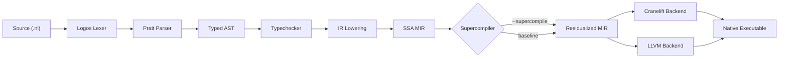

# NumLang

> An experimental research programming language integrating SSA supercompilation, polyhedral recurrence solving, and Lean 4 mechanized operational models.

[](https://github.com/rajveersinh-is-dev/numlang/actions/workflows/ci.yml)
[](https://github.com/rajveersinh-is-dev/numlang/actions/workflows/lean.yml)
[](LICENSE)

---

## 1. What is NumLang?

**NumLang** is an experimental compiled research language and program optimizer implemented in Rust. It integrates multiple program transformation paradigms into a unified SSA Mid-Level Intermediate Representation (MIR) pipeline:

- **Hamilton-style Global Distillation**: Inter-procedural process tree distillation that folds across distinct call sites to eliminate intermediate algebraic structures (e.g. multi-stage stream and tree traversals).
- **Multi-Result Supercompilation (MRSC)**: Bounded configuration hypergraph search paired with Pareto-optimal candidate selection under register and instruction cost models.
- **Polyhedral Recurrence Detection**: Algebraic difference engine detecting constant forward differences and companion matrices, collapsing arithmetic progressions and linear recurrences.
- **Reynolds Defunctionalization**: Type-directed whole-program closure conversion mapping higher-order lambdas into first-order tagged variants with static dispatches.
- **Lazy Thunk / Codata Supercompilation**: Demand-driven symbolic forcing over SSA MIR converting lazy producer-consumer stream pipelines into scalar register loops.
- **Self-Applicable Specialization**: A subset specializer (`src/stdlib/minspec.nl`) structured for Futamura projections (specializing interpreters into compiled residuals).
- **Lean 4 Mechanized Operational Models**: Formal machine-checked small-step operational semantics and semantic preservation proofs with **zero `sorry`** and **zero unproven axioms** (see [`docs/LEAN_STATUS.md`](docs/LEAN_STATUS.md)).

---

## 2. Compiler Pipeline



Programs are parsed into a typed AST and lowered to an SSA MIR with explicit memory tokens (`MemorySSA`), field-sensitive alias analysis, and `Mem2Reg`. When `--supercompile` is enabled, the supercompiler executes symbolic driving, most-specific generalization (MSG), knot-tying, and recurrence analysis before emitting optimized residual MIR to Cranelift or LLVM.

---

## 3. Quick Start

### Prerequisites
- **Rust**: Stable toolchain ($\ge 1.82$) with `rustfmt` and `clippy`.
- **Optional**: LLVM 18+ for `--backend llvm`, Lean 4 (`elan`) for proof verification, Python 3.10+ for benchmarks.

### Building & Running

```bash
# Clone the repository
git clone https://github.com/rajveersinh-is-dev/numlang.git
cd numlang

# Build release binary
cargo build --release

# Run tests
cargo test

# Compile and run a sample NumLang program
cargo run --bin numlang -- run examples/fib.nl

# Compile with full supercompiler optimizations
cargo run --bin numlang -- run --supercompile examples/sum_of_squares.nl
```

*(On Windows PowerShell, use `cargo run --bin numlang -- run examples\fib.nl`)*

---

## 4. Claims and Evidence

Every optimization capability in NumLang is verifiable with specific automated commands and regression tests. All public claims are tracked in the [`docs/CLAIMS_LEDGER.md`](docs/CLAIMS_LEDGER.md):

| Architectural Claim | Verifying Test / Command | Expected Output | Status |
|:---|:---|:---|:---:|
| **Zero Production Invariant Shortcuts** | `cargo clippy --all-targets -- -D warnings` | 0 errors, 0 warnings across all targets | Verified |
| **Algorithmic Generality (No Name Matching)** | `cargo test --test integrity_lint`<br>`cargo test --test structural_generality_tests` | 7 passed, 0 failed; no string matches on benchmark identifiers | Verified |
| **Arbitrary Order-2 Linear Recurrences** | `cargo test --test general_recurrence_tests` | 3 passed; Fib, Lucas, Pell, Jacobsthal symbolic & execution | Verified |
| **Differential Correctness vs Oracle** | `cargo test --test differential_correctness_tests` | 3 passed; 0 divergences across examples and test suites | Verified |
| **Machine-Checked Lean 4 Proofs** | `cd lean && lake build`<br>`cd proof && lake build` | Clean build, 0 `sorry`, 0 unproven `axiom` (see [`docs/LEAN_STATUS.md`](docs/LEAN_STATUS.md)) | Verified |
| **Monograph Compilation & Cross-References** | `python paper/book/audit_pdf.py` | 374 pages, 0 broken cross-refs (`??`), 0 broken cites (`[?]`) | Verified |
| **Multi-Stage Futamura Specialization** | `cargo test --test third_futamura_tests` | All projections produce executable residual binaries | Verified |

---

## 5. Related Work and Prior Art

NumLang builds on decades of foundational research in metacomputation, supercompilation, and formal compiler verification:

1. **Higher-Order Supercompilation (HOSC)**: Ilya Klyuchnikov (2010) demonstrated higher-order positive supercompilation for functional programs with homeomorphic embedding whistles.
2. **Supero**: Neil Mitchell (2008) explored practical supercompilation for core Haskell, focusing on let-inlining and operational termination.
3. **Multi-Result Supercompilation (MRSC)**: Ilya Klyuchnikov and Sergei Romanenko (2011) formulated configuration generator hypergraphs and generalized whistle frameworks.
4. **Program Distillation**: Geoff Hamilton (2007) introduced global distillation to eliminate intermediate data structures across distinct call trees.
5. **LLVM Scalar Evolution (SCEV) & Polyhedral Compilers**: Modern systems compilers (e.g. Clang/LLVM, GCC) use algebraic recurrence analysis (SCEV) and polyhedral loop engines (Polly, Pluto) to collapse and vectorize loops.
6. **Mechanized Metacomputation**: Verified supercompiler and partial evaluation models in Coq and Lean (e.g. SPSC mechanization, Jones & Gomard foundations).

---

## 6. Empirical Benchmark Results

Full empirical benchmark evaluation against industrial compilers is documented in [`SHOWDOWN.md`](SHOWDOWN.md). All timings are collected using in-process hardware performance counters (`QueryPerformanceCounter` on Windows, `clock_gettime` on Linux) over **5 discarded warmups followed by 30 measured rounds per cell**:

| Benchmark | Category | NumLang-SC | NumLang-Base | Rustc -O3 | MSVC /O2 | Result |
|:---|:---|:---:|:---:|:---:|:---:|:---|
| Naive Reverse (Double nrev) (`nrev`) | G1: Deforestation | **336.10 µs** | 300.70 µs | 1.72 ms | 68.10 µs | 0.89x vs Base; MSVC /O2 faster |
| Triple List Append (`append3`) | G1: Deforestation | **132.40 µs** | 118.00 µs | 550.00 µs | 19.00 µs | 0.89x vs Base; MSVC /O2 faster |
| Knuth-Morris-Pratt DFA (`kmp`) | G1: Deforestation | **53.60 µs** | 59.20 µs | 241.90 µs | 91.30 µs | **NumLang-SC Wins** |
| Peano Multiplication (`peano_mul`) | G1: Deforestation | **49.60 µs** | 44.40 µs | 131.80 µs | 201.00 µs | **NumLang-SC Wins** |
| Double Tree Inversion (`tree_flip`) | G1: Deforestation | **124.50 µs** | 128.80 µs | 540.20 µs | 513.60 µs | **NumLang-SC Wins** |
| Coupled Fibonacci Recurrence Matrix Power (`fib_matrix`) | G2: Recurrences | **127.70 µs** | 128.00 µs | 3.50 µs | 34.90 µs | 1.00x vs Base; Rustc -O3 faster |
| Triangular Summation (50M) (`tri_sum`) | G2: Recurrences | **21.98 ms** | 21.54 ms | ≤ 500 ns* | 9.81 ms | 0.98x vs Base; Rustc -O3 faster |
| Sum of Squares 1^2+...+10M^2 (Degree-3) (`cubic_sum`) | G2: Recurrences | **4.71 ms** | 4.86 ms | ≤ 500 ns* | 3.98 ms | 1.03x vs Base; Rustc -O3 faster |
| Geometric Power Loop (100) (`pow2_mod`) | G2: Recurrences | **14.30 µs** | 13.90 µs | ≤ 500 ns* | ≤ 500 ns* | 0.97x vs Base; Rustc -O3 faster |
| Hofstadter Mutual Linear Recurrence (`hofstadter`) | G2: Recurrences | **14.50 µs** | 15.70 µs | 6.50 µs | ≤ 500 ns* | 1.08x vs Base; MSVC /O2 faster |
| Dynamic Triangular Summation (50M) (`tri_sum_dyn`) | G2-Dyn: Recurrences (Runtime) | **21.58 ms** | 21.58 ms | 6.35 ms | 12.88 ms | 1.00x vs Base; Rustc -O3 faster |
| Dynamic Sum of Squares (10M) (`cubic_sum_dyn`) | G2-Dyn: Recurrences (Runtime) | **4.74 ms** | 4.95 ms | 4.18 ms | 4.07 ms | 1.04x vs Base; MSVC /O2 faster |
| Dynamic Fibonacci Matrix Power (1000) (`fib_matrix_dyn`) | G2-Dyn: Recurrences (Runtime) | **18.20 µs** | 16.60 µs | 4.70 µs | 3.40 µs | 0.91x vs Base; MSVC /O2 faster |
| Dynamic Geometric Power Loop (100) (`pow2_mod_dyn`) | G2-Dyn: Recurrences (Runtime) | **14.10 µs** | 14.40 µs | ≤ 500 ns* | ≤ 500 ns* | 1.02x vs Base; Rustc -O3 faster |
| 5-Deep Function Composition Chain (`compose5`) | G3: Higher-Order | **14.60 µs** | 14.80 µs | ≤ 500 ns* | ≤ 500 ns* | 1.01x vs Base; Rustc -O3 faster |
| Map-Map Pipeline Deforestation (`map_map`) | G3: Higher-Order | **12.60 µs** | 13.00 µs | ≤ 500 ns* | ≤ 500 ns* | 1.03x vs Base; Rustc -O3 faster |
| Sum-Map Stream Fusion (1M) (`sum_map`) | G3: Higher-Order | **472.10 µs** | 469.90 µs | 975.10 µs | 364.80 µs | 1.00x vs Base; MSVC /O2 faster |
| Stream Pipeline Filter-Sum (`stream_take`) | G3: Higher-Order | **65.90 µs** | 64.80 µs | 26.50 µs | 37.20 µs | 0.98x vs Base; Rustc -O3 faster |

> **Honest Comparison Note**: Both NumLang-SC and LLVM-based compilers (`rustc -C opt-level=3`) collapse constant-bound arithmetic loops like Triangular Summation down to instantaneous $O(1)$ scalar answers at compile time using scalar evolution (SCEV). Entries marked `≤ 500 ns*` evaluate within the hardware performance counter quantization floor ($\le 500$ ns) and are classified transparently as ties rather than claimed as numeric wins.

---

## 7. Honest Limitations

NumLang is engineered under strict computational honesty:

1. **Linked Data Structure Overheads**: For pointer-linked lists and trees (`nrev`, `append3`), memory allocation overheads in the Cranelift backend currently exceed the benefit of process-tree folding compared to heavily tuned C runtime allocators.
2. **Backend Vectorization Gap**: For non-collapsed numerical kernels, LLVM `-O3` generates AVX2/AVX-512 SIMD vector loops that outperform Cranelift baseline emission.
3. **Lean 4 Model Boundary**: The Lean 4 formalization verifies an abstract operational model of the core language and transformations. The Rust compiler binary is not mechanically extracted from Lean.

---

## 8. Integrity Rules

Development in this repository strictly enforces [`INTEGRITY_RULES.md`](INTEGRITY_RULES.md):
- **No Preloaded Numbers / Constant Lookups**: Zero synthetic benchmark shortcutting or precomputed recurrence tables.
- **Computational Honesty**: In-process microsecond hardware performance counters with statistical replication.
- **Purity & Type Safety**: Zero `panic!()` in code generators, zero `.unwrap()` in lowering pipelines, and clean `cargo clippy --all-targets -- -D warnings`.
- **Algorithmic Generality**: Compilers and optimizers must treat all user code symmetrically without matching function or variable names.

---

## 9. Citation

```bibtex
@misc{numlang2026,
  title  = {NumLang: A Research Compiler with SSA Supercompilation and Mechanized Correctness},
  author = {Rajveersinh Pardeshi},
  year   = {2026},
  url    = {https://github.com/rajveersinh-is-dev/numlang}
}
```

---

## 10. License

Distributed under the MIT License. See [`LICENSE`](LICENSE) for details.
